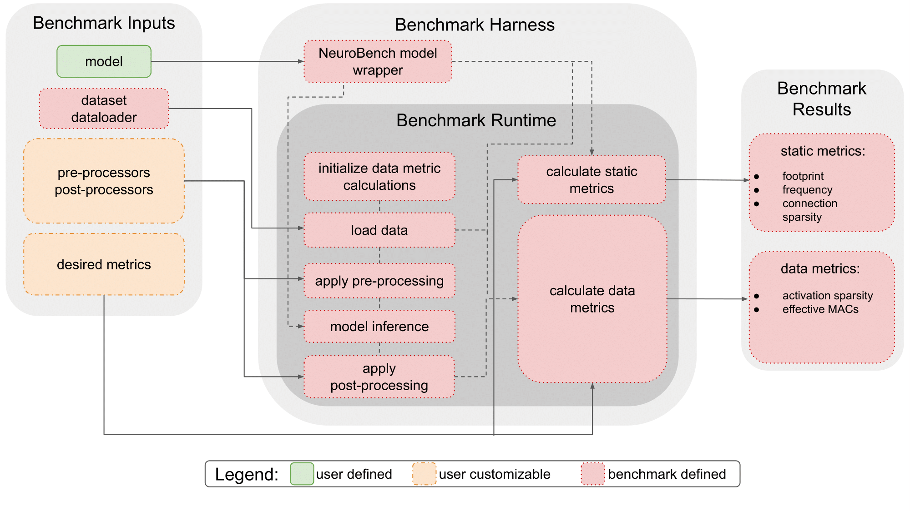

# Staging tasks to the NeuroBench benchmarking suite
This is the area where anyone in the neuromorphic community can implement their own custom metrics, pre- and post-processing functions, datasets or a combination of the aforementioned, in tasks. 
The most used staged tasks before every release of a new version of NeuroBench will be considered for addition to the official framework. 
Tasks that are selected to be included in a release will be thoroughly tested and validated and moved to the official list of tasks found in the tasks folder.

To start the staging of your custom implentation, first select the right folder:
```
a_dataset: for custom datasets
b_metrics: for custom metrics
c_pre_post_processors: for custom pre- and post- processors
d_full_tasks: for implementations of fully novel tasks (combination of two or more of the above)
```
Within the correct folder, you can implement your idea. Please refer to the [API](/API.md)


## Custom datasets
To create a custom dataset, you should use the `NeuroBenchDataset` as super-class. This makes sure your dataset has the correct methods to be handled by the NeuroBench framework. Next to that, you should be able to load this dataset in a PyTorch `DataLoader`. 

It is advised that the user can choose the split (training/testing). If possible, it is preferred that the data can be automatically downloaded with a script, else there should be a clear tutorial on how users can acquire the required dataset. To keep NeuroBench lightweight, we do not plan on hosting datasets.

## Custom metrics
To start implementing your own metrics, you can use the `Staged_Metric_Benchmark` class. This is an extended version of the Benchmark class. It gives you the opportunity to use a custom metric. 

Where the regular `Benchmark`-class expects a list with `[static metrics, data metrics]`, the `Staged_Benchmark` expects a list with `[static metrics, data metrics, staged metrics]`. The benchmark will pass the model, the model predictions (after post-processing) and the input data to your metric:
```
staged_metric(model, predictions, data)
```

If your metric is static and only needs the model as input, you can ignore the other inputs. If your metric is accumelated, please make it an `AccumelatedMetric` object, for which the source code can be found in neurobench/benchmarks/data_metrics.py. This will allow the correct computation of your metric.


## Custom pre- or post-processing
For custom pre- or post-processing implementations, import them and pass them to the `Benchmark`. No other changes should be necessary. From the figure underneath, it can be seen that the pre- and post-processing functions are in between the data and the model, and the model and the metric calculations respectively. Therefore, the processing functions should be consistent with expected shape formats (batch, timesteps, ...).

## File structure
We strongly recommend you to adhere to the conventions used in the official tasks and to clearly document the usage of your task.
The file structure used in the official tasks is:
```
├── name_task
│   ├── model_data
│   │   ├── parameter_file_of_model.pth
│   ├── model_specification.py
│   ├── training.py
│   ├── benchmark.py
|   ├── task_tutorial.ipynb
```

An example of your file structure would be:
```
├── d_full_task
|   ├── my_task
│   |   ├── model_data
│   |   │   ├── parameter_file_of_model.pth
│   |   ├── model_specification.py
│   |   ├── training.py
│   |   ├── benchmark.py
|   |   ├── task_tutorial.ipynb
|   |   ├── staged_metrics.py
|   |   ├── staged_dataset.py
|   |   ├── staged_pre_post_processing.py
```

An example of your `benchmark.py` file is shown below.

```python
import torch
from torch.utils.data import DataLoader

import snntorch as snn

from torch import nn
from snntorch import surrogate

from neurobench.staged_tasks.d_full_tasks.mytask.model_specification import model_spec
from neurobench.staged_tasks.d_full_tasks.mytask.staged_dataset import DataSet
from neurobench.staged_tasks.d_full_tasks.mytask.staged_pre_post_processing import preproc, postpoc

from neurobench.staged_tasks.Staged_Metric_Benchmark

test_set = DataSet("path", split="testing")
test_set_loader = DataLoader(test_set, batch_size=16, shuffle=True,drop_last=True)

net = model_spec()
net.load_state_dict(torch.load('neurobench/staged_tasks/d_full_task/ny_task/model_data/my_parameters.pth'))

## Define model ##
model = SNNTorchModel(net)

# postprocessors
preprocessors = [preproc]

# postprocessors
postprocessors = [postproc]

static_metrics = ["model_size"]
data_metrics = ["classification_accuracy"]
staged_metrics = ["my_metrics"]

my_metrics_path = "neurobench/staged_tasks/d_full_tasks/mytask/staged_metrics"
benchmark = Staged_Metric_Benchmark(model, test_set_loader, preprocessors, postprocessors, [static_metrics, data_metrics, staged_metrics],my_metrics_path)

results = benchmark.run_staged()
print(results)


```

## Other custom implementations
If you have an idea you would like to implement, but it is not discussed in this file, please reach out to the maintainers of this repository!

### <ins>**Disclaimer**</ins>: tasks in this folder are **not** moderated.
